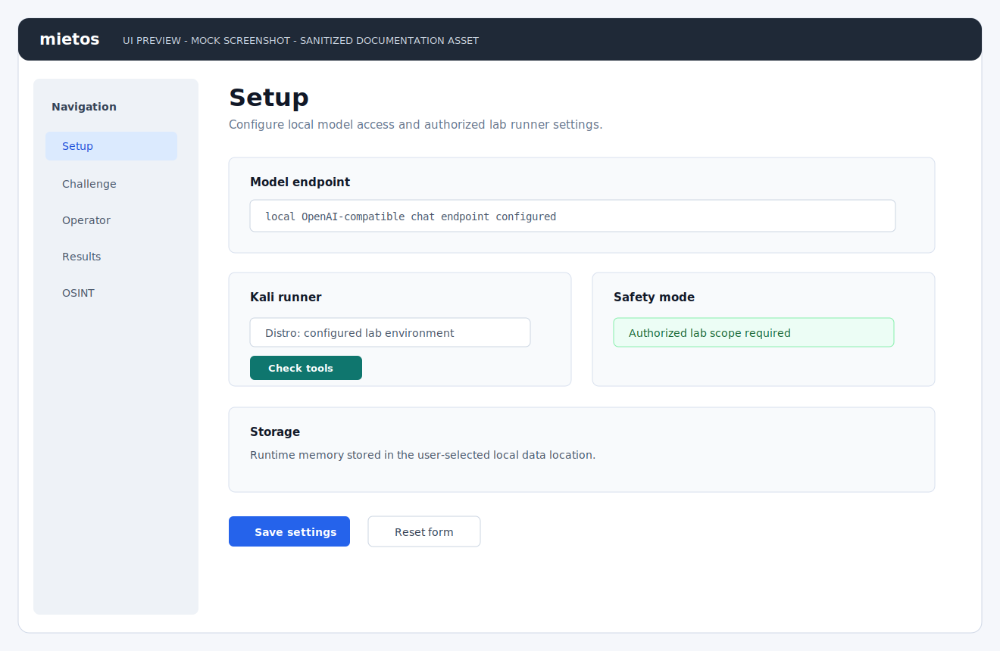
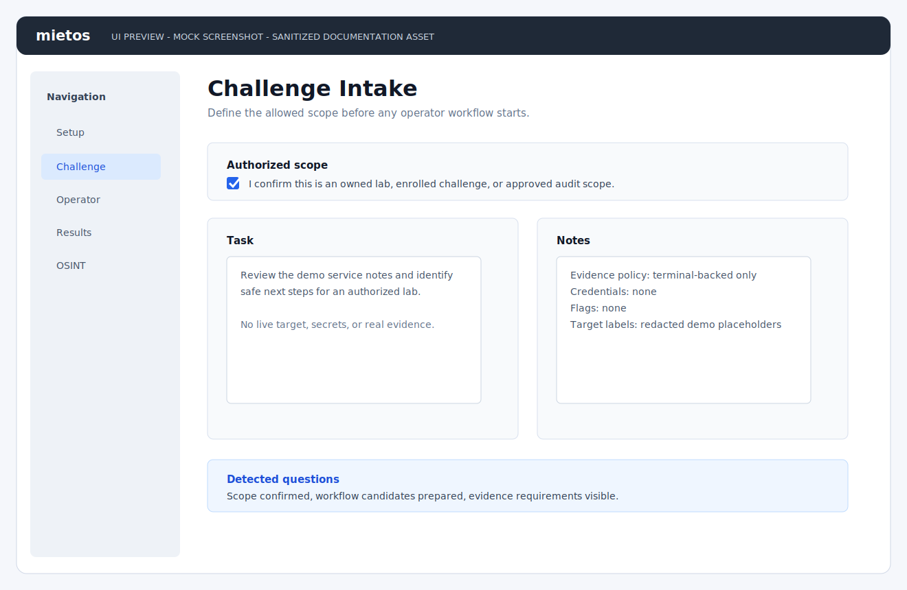
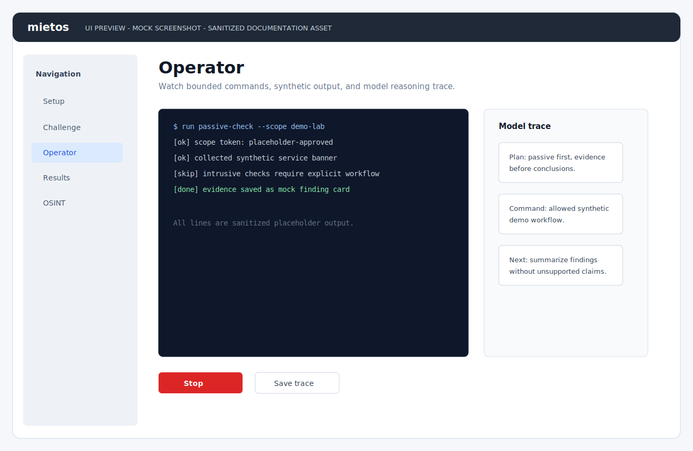
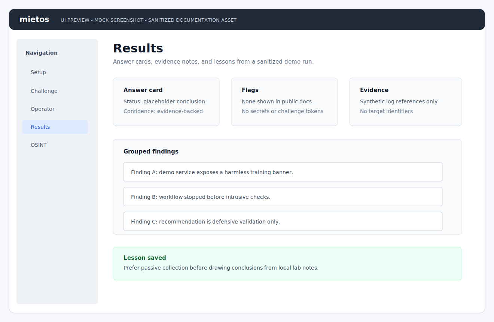
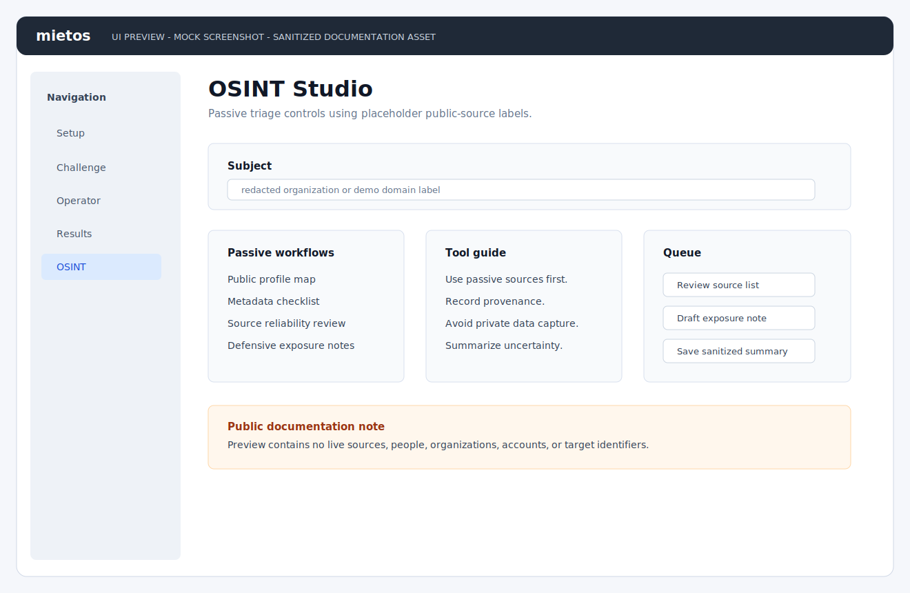

# Screenshots

This repository includes sanitized SVG UI previews instead of real target evidence.
They are mock screenshots for documentation only, not captures from an active
assessment, lab run, customer environment, or real target.

Every preview uses placeholder labels and avoids real flags, credentials, IP
addresses, private paths, personal data, customer names, and target identifiers.

## Preview Set

| Area | Preview |
| --- | --- |
| Setup |  |
| Challenge |  |
| Operator |  |
| Results |  |
| OSINT |  |

## Asset Rules

- Treat these SVGs as documentation previews, not operational evidence.
- Keep the visible "UI PREVIEW - MOCK SCREENSHOT" label in every asset.
- Use only synthetic task text, synthetic findings, and placeholder statuses.
- Do not include real flags, credentials, IP addresses, private URLs, VPN config
  names, model paths, scan output, customer notes, or personal filesystem paths.
- If real screenshots are added later, store them separately and verify that all
  sensitive data is redacted before publishing.
